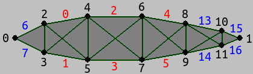
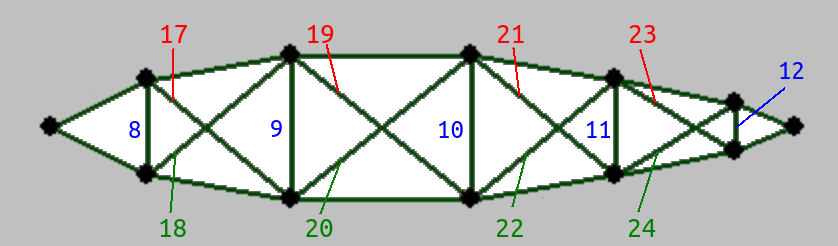
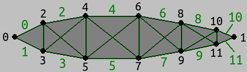

*******************
Experimental Stuff
******************* 

Two-dimensional fish anatomy
=============================

Nodemasses and Outer springs (Muscles are 0-5):

Inner springs:

Simulated quads for hydrodynamic forces:

hydro_fish.py
=============

.. automodule:: hydro_fish